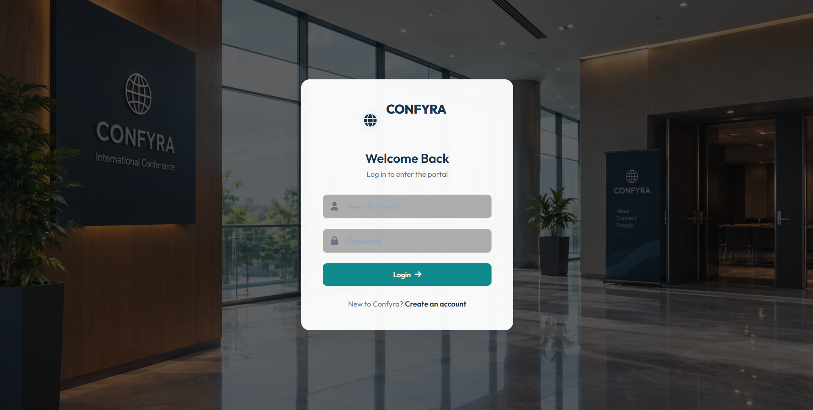
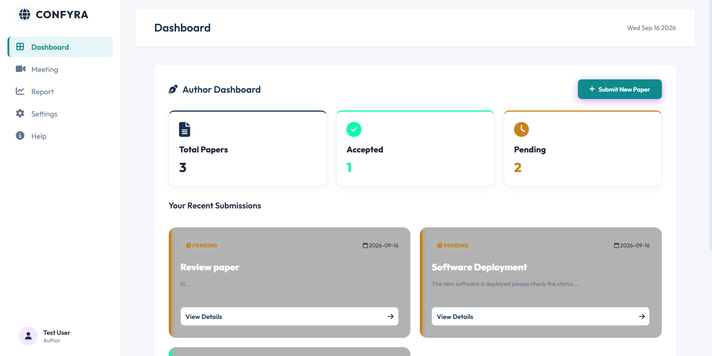
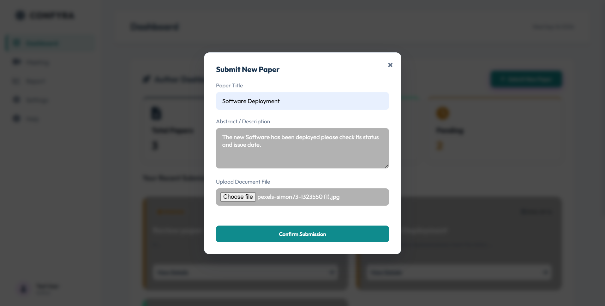
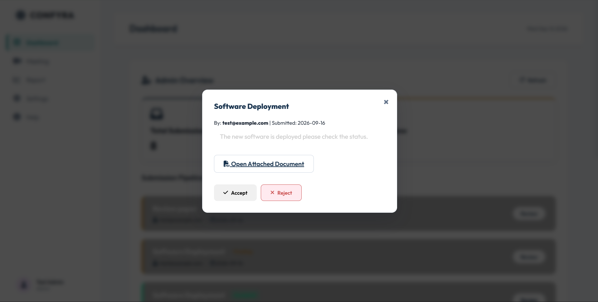
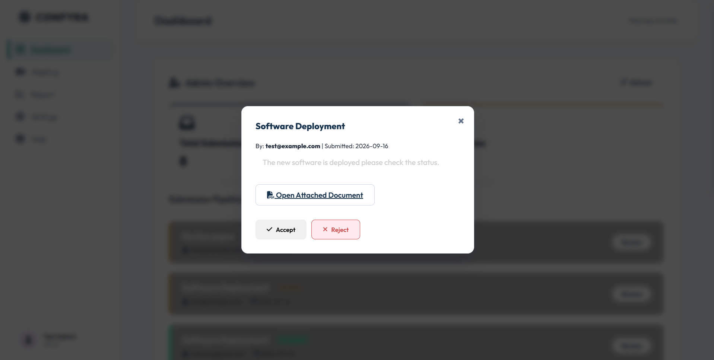
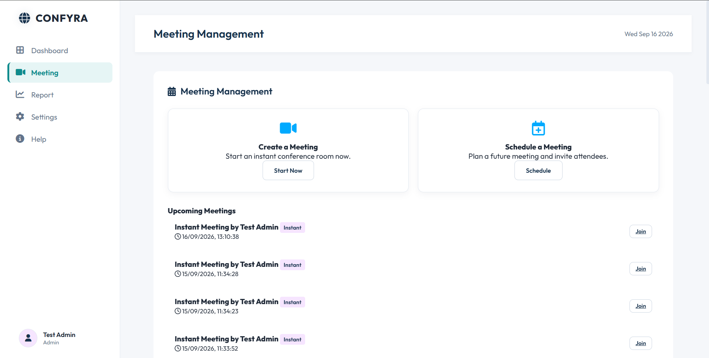
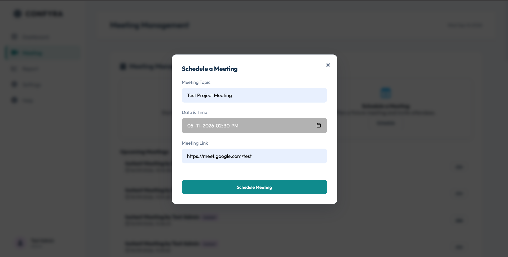
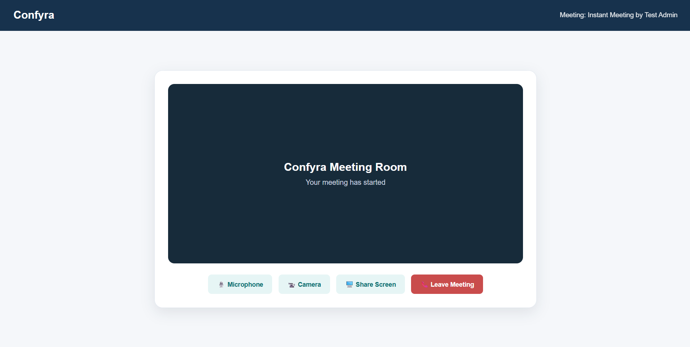

# Confyra - Conference Management System

Confyra is a web-based Conference Management System developed to manage research paper submissions, paper reviews, and conference meetings.

The system provides separate dashboards for authors and administrators. Authors can submit research papers, upload documents, track their submission status, and view meetings. Administrators can review submitted papers and manage conference meetings.

---

## Overview

The main purpose of Confyra is to provide a simple platform for managing common conference activities in one place.

The system includes:

* User registration and login
* Author dashboard
* Administrator dashboard
* Research paper submission
* Paper document upload
* Paper review and status management
* Instant meeting creation
* Scheduled meetings
* Meeting links
* Reports section
* Account settings
* Password management

---

## Features

### Author Dashboard

Authors can:

* Register and log in
* Submit research papers
* Upload paper documents
* View submitted papers
* Track paper status
* View paper details
* View upcoming meetings
* Join available meetings
* View reports
* Change password
* Log out

### Administrator Dashboard

Administrators can:

* Log in to the administrator dashboard
* View submitted research papers
* Review submitted papers
* Accept or reject papers
* Create instant meetings
* Schedule future meetings
* Add meeting links
* View conference meetings
* View reports
* Manage account settings

---

## Paper Submission Workflow

The paper submission process works as follows:

```text
Author
   |
   v
Login
   |
   v
Submit Research Paper
   |
   v
Paper Status: Pending
   |
   v
Administrator Review
   |
   +-------------------+
   |                   |
   v                   v
Accepted            Rejected
```

Authors can check the current status of their submitted papers from the dashboard.

---

## Meeting Management

Confyra supports both instant and scheduled meetings.

### Instant Meeting

Administrators can create an instant meeting from the Meeting section.

The system creates a meeting room link and adds the meeting to the meeting list.

### Scheduled Meeting

Administrators can schedule a future meeting by providing:

* Meeting topic
* Date and time
* Meeting link

The scheduled meeting is then displayed in the meetings section.

### Meeting Room

The project also includes a meeting room interface for demonstration purposes.

The current version does not include real-time video and audio communication using WebRTC.

---

## Technology Stack

### Frontend

* HTML5
* CSS3
* JavaScript
* Font Awesome
* Google Fonts

### Backend

* Python
* Flask
* Flask-CORS

### Database

* SQLite

### Development Tools

* Visual Studio Code
* Git
* GitHub

---

## Project Structure

```text
Confyra/
│
├── .gitignore
├── .vscode/
│   └── settings.json
│
├── app.py
├── index.html
├── script.js
├── styles.css
├── requirements.txt
│
├── conference_bg.png
└── dashboard_bg.png
```

---

## File Description

| File                | Description                                        |
| ------------------- | -------------------------------------------------- |
| `app.py`            | Flask backend, API routes, and database operations |
| `index.html`        | Main application interface                         |
| `script.js`         | Frontend functionality and API communication       |
| `styles.css`        | Application styling                                |
| `requirements.txt`  | Python dependencies                                |
| `conference_bg.png` | Login and conference background image              |
| `dashboard_bg.png`  | Dashboard background image                         |
| `.gitignore`        | Files excluded from Git                            |

---

## Database

Confyra uses SQLite as its database.

The database stores information related to:

* Users
* Research papers
* Paper submission status
* Meetings

The local SQLite database file is excluded from the GitHub repository using `.gitignore`.

---

## Application Workflow

### Author Workflow

```text
Register
   |
   v
Login
   |
   v
Author Dashboard
   |
   +---- Submit Paper
   |
   +---- View Papers
   |
   +---- Track Status
   |
   +---- View Meetings
   |
   +---- Join Meeting
   |
   +---- Reports
   |
   +---- Settings
```

### Administrator Workflow

```text
Login
   |
   v
Administrator Dashboard
   |
   +---- View Papers
   |
   +---- Review Papers
   |        |
   |        +---- Accept
   |        |
   |        +---- Reject
   |
   +---- Create Instant Meeting
   |
   +---- Schedule Meeting
   |
   +---- View Meetings
   |
   +---- Reports
   |
   +---- Settings
```

---

## Screenshots

Screenshots of the application are available in the `screenshots` folder.

### Login Page



### Author Dashboard



### Paper Submission



### Administrator Dashboard



### Paper Review



### Meeting Management



### Schedule Meeting



### Meeting Room



---

## How to Run Locally

### 1. Clone the Repository

```bash
git clone https://github.com/Jijo081/confyra.git
```

### 2. Open the Project Directory

```bash
cd confyra
```

### 3. Create a Virtual Environment

For Windows:

```bash
python -m venv venv
```

### 4. Activate the Virtual Environment

```bash
venv\Scripts\activate
```

### 5. Install the Required Dependencies

```bash
pip install -r requirements.txt
```

### 6. Start the Flask Server

```bash
python app.py
```

### 7. Open the Application

Open the following address in your browser:

```text
http://127.0.0.1:5000
```

The SQLite database will be created automatically when the application starts.

---

## User Roles

| Role          | Access                                                  |
| ------------- | ------------------------------------------------------- |
| Author        | Paper submission, paper tracking, meetings, and reports |
| Administrator | Paper review, meeting management, reports, and settings |

---

## Current Limitations

The current version is mainly intended for academic and portfolio purposes.

The following features are not implemented yet:

* Password hashing
* Session-based authentication
* Email notifications
* Reviewer assignment
* Real-time video conferencing
* WebRTC integration
* Cloud file storage
* Advanced analytics
* Email-based paper notifications

---

## Future Improvements

Some features that can be added in future versions include:

* Secure password hashing
* Session or token-based authentication
* Reviewer management
* Email notifications
* Advanced paper filtering and search
* Real-time video conferencing using WebRTC
* Calendar integration
* Cloud-based document storage
* Conference analytics
* Online deployment

---

## Learning Outcomes

Working on this project provided practical experience in:

* Full-stack web development
* Python Flask
* REST API development
* SQLite database management
* File upload handling
* JavaScript and API integration
* HTML and CSS
* Role-based application workflows
* Git and GitHub
* Version control and project management

---

## Repository

GitHub Repository:

https://github.com/Jijo081/confyra

---

## Developer

**Jijo**

Computer Science and Engineering Student

GitHub:

https://github.com/Jijo081

---

## License

This project was developed for academic and portfolio purposes.
